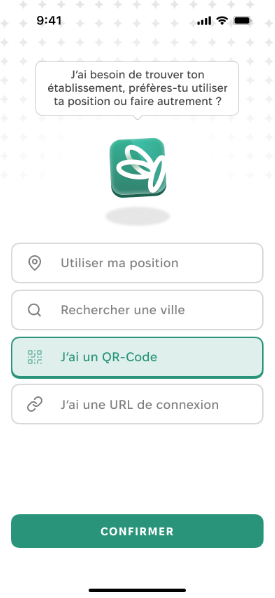
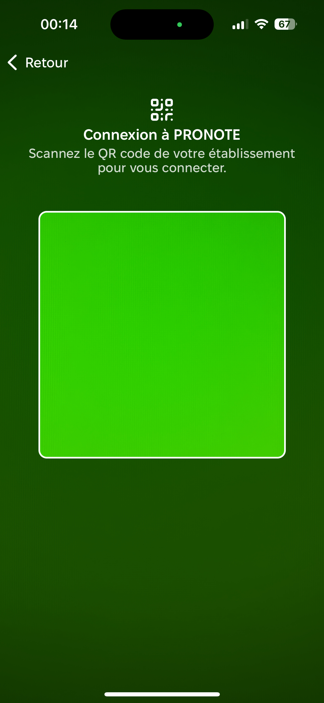
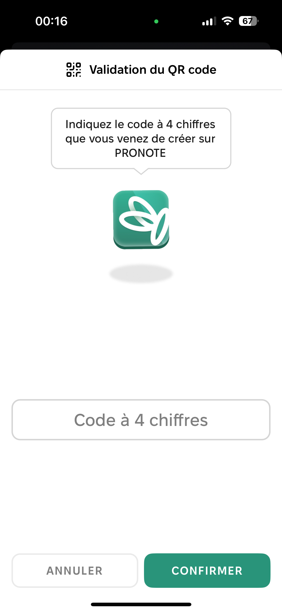

# 🏫 Établissement manquant

Sur les logiciels Pronote et Skolengo, il existe un moyen de rechercher des établissements à proximité. Cependant, il est possible de ne pas trouver le sien. Pourquoi et que faire ?

### Pourquoi il manque mon établissement, pouvez-vous l'ajouter ?

Les listes ne sont pas maintenues par Papillon et cela relève de l'établissement si il souhaite être indexé dans l'annuaire ou non. Nous ne pouvons rien y faire.\\


Ce n'est pas parce que votre établissement n'apparaît pas qu'il est incompatible avec Papillon : **il peut quand même fonctionner.**


### **Autres moyens de se connecter**

#### **Avec un QR-Code sur Pronote**

Connecte-toi à Pronote via un ordinateur ou un autre appareil, et lie Papillon à l'aide de l'option QR code mobile, cela te permet de ne pas chercher ton établissement


Attention : **Un code vous sera demandé lors de la création du Code QR, il faudra donc le retenir afin de le mettre dans l'app Papillon.**


<figure><figcaption>
Choisir "J'ai un QR Code"
</figcaption></figure> <figure><figcaption>
Scanner le code QR (avec la Caméra Arrière)
</figcaption></figure> <figure><figcaption>
Entrer le code
</figcaption></figure> <figure><figcaption>
Félicitations ! Vous êtes connecté.e.
</figcaption></figure>


Vous pouvez maintenant utiliser Papillon avec votre appareil ! :tada:


#### Avec une URL

Lorsque tu es sur la page de ton établissement via un navigateur web, tu peux copier le lien en barre d'adresse et te connecter via une URL à Papillon !
